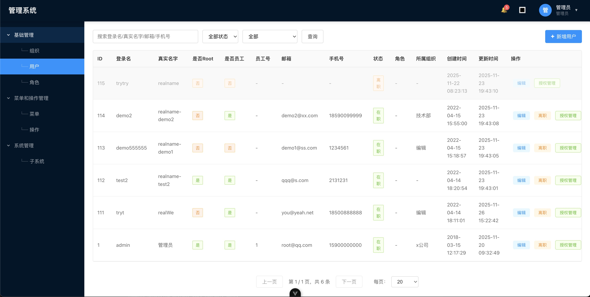

# donkey-admin-front

前后端分离的管理后台系统，基于 Vue 3 开发，提供完整的用户权限管理、组织架构管理等功能。

本项目结合 donkey-admin-backend 使用

## 功能

### 用户认证
- 用户登录/登出

### 组织管理
- 组织架构分页查询
- 组织新增/编辑/删除

### 用户管理
- 用户列表分页查询
- 用户新增/编辑/删除
- 用户状态管理（启用/禁用）
- 用户授权管理（ACL），支持菜单和按钮级权限控制

### 角色管理
- 角色列表分页查询
- 角色新增/编辑/删除
- 设置角色权限

### 菜单管理
- 菜单列表分页查询
- 菜单新增/编辑/删除
- 动态菜单加载，根据用户权限显示可见菜单

### 操作管理
- 操作按钮列表分页查询
- 操作新增/编辑/删除
- 与菜单关联，控制页面操作权限

### 子系统管理
集中统一管理企业多系统的菜单和按钮权限，其他系统只关系业务，基础的员工、菜单、组织等数据，API请求本系统
- 子系统分页查询
- 子系统新增/编辑/删除

### 权限系统
- **页面权限**：基于菜单路由的访问控制
- **按钮权限**：基于操作的细粒度权限控制
- **动态权限**：从后台获取权限数据，实时更新

### 用户通知
 - TODO

### 其他功能
- 审批流程管理 demo 
- 仪表盘视图 demo 

## 开发文档

详细的开发文档请参考 [docs](./docs/) 目录：

- [快速开始指南](./docs/zh-CN/guide.md) - 系统使用指南
- [架构设计](./docs/zh-CN/architecture.md) - 系统架构说明
- [用户权限](./docs/zh-CN/user-permission/permission.md) - 登录登出、权限管理文档

## 特性

- ✅ 前后端分离架构
- ✅ 基于 Cookie 的认证机制
- ✅ 细粒度权限控制（页面 + 按钮）
- ✅ 动态菜单加载
- ✅ 响应式设计
- ✅ 模块化代码结构
- ✅ 统一的 API 请求封装
- ✅ 完善的错误处理

## License

Private

# 预览
